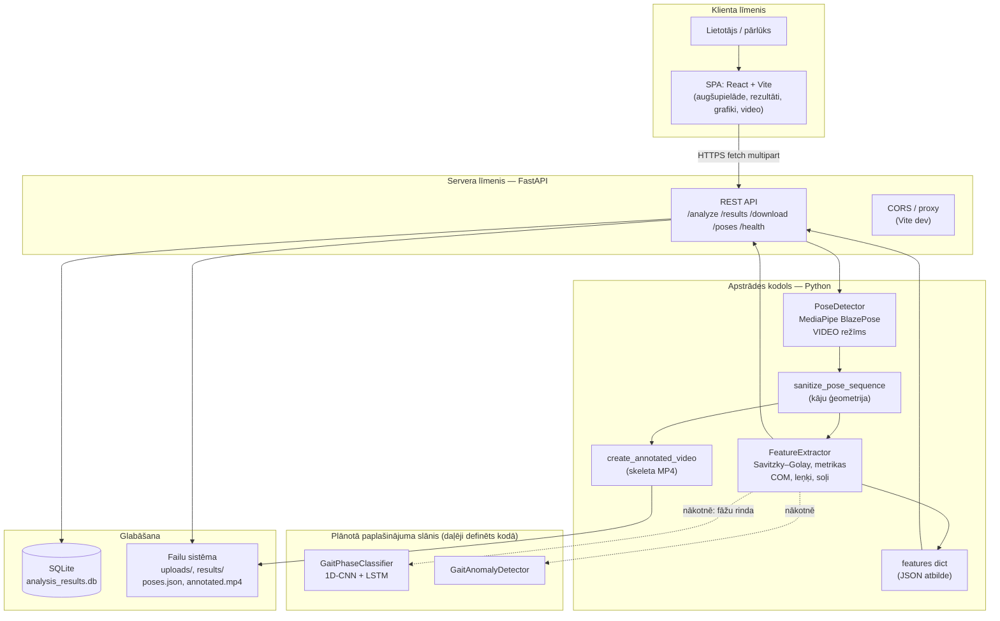
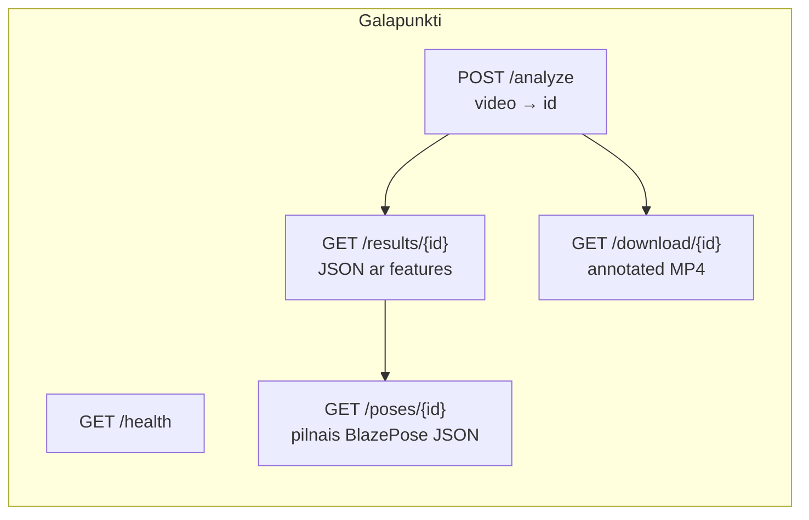
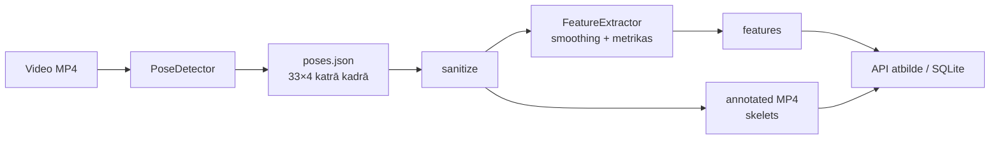
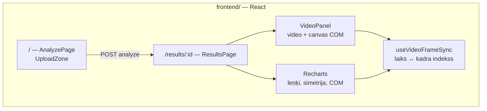

# Skrējiena gaitas analīze — programmatūras arhitektūras blokshēmas

Šis dokuments apkopo **plānoto un pašreiz implementēto** sistēmas arhitektūru. Diagrammas renderējas GitHub/GitLab un VS Code/Cursor (Mermaid spraudnis). Drukāšanai: eksportēt PNG no [mermaid.live](https://mermaid.live).

---

## 1. Augsta līmeņa skats (lietotājs → serveris → dati)

Plānotā pilnā struktūra: viena tīmekļa lietotne, REST API, modulāra apstrāde, failu un SQLite glabāšana.

**Leģenda:** cietā bultiņa — pašreizējā datu plūsma; pārtraukta līnija (`-.->`) — **plānota** ML saite, kad modelis ir apmācīts un pieslēgts API.

---

## 2. HTTP pieprasījumu un artefaktu plūsma

---

## 3. Video apstrādes secība (kodola pipeline)

Tas pats, kas `process_video` / API iekšējā loģika: secīgi un skaidri moduļi.

---

## 4. Frontend iekšējā loģika (plānotā UI arhitektūra)

---

## 5. Moduļu un mapes atbilstība (īss indekss)

| Bloks diagrammā | Repozitorija ceļš |
|-----------------|-------------------|
| PoseDetector | `core/pose_detection.py` |
| sanitize | `utils/pose_foot_sanitize.py` |
| FeatureExtractor | `core/feature_extractor.py` |
| create_annotated_video | `utils/visualization.py` |
| FastAPI | `api/app.py` |
| ML definīcijas | `models/gait_classifier.py` |
| SPA | `frontend/src/` |

---

## 6. Piezīmes disertācijai / darbam

- **Plānotā** arhitektūra ietver **pilnu cilpu**: video ievade → poza → sanitizācija → biomehāniskie lielumi → vizualizācija → JSON/DB → tīmekļa atskaite. **ML fāžu klasifikators** ir atzīmēts kā paplašinājums, jo arhitektūra (`GaitPhaseClassifier`) ir sagatavota, bet **produkcijas API** var vēl neeksportēt `phases_per_frame` visos scenārijos.
- Ja nepieciešams **viena lapa** ar vienu attēlu, izdrukājiet tikai **§1** diagrammu vai apvienojiet to ar institūcijas veidni.

---

*Atjaunināšanas avots: `docs/SYSTEM_OVERVIEW_AND_CURRENT_STATE.md`, `api/app.py`, `frontend/` struktūra.*
