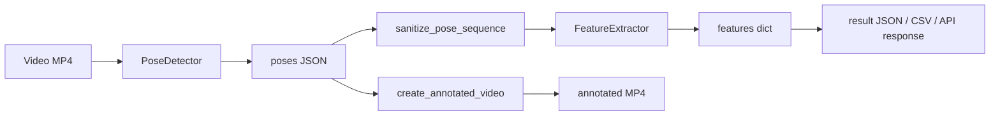

# Running Gait Analysis — System Overview & Current State

This document describes **what the program is designed to do**, **what is implemented today**, and the **actual state of the repository** as of the last thesis workflow update (2026). It is meant for supervisors, future you, or anyone onboarding to the codebase.

**Related:** single-step checklist in [`THESIS_FOLLOW_THROUGH_GUIDE.md`](THESIS_FOLLOW_THROUGH_GUIDE.md), visual QA log in [`MediaPipe_Accuracy_Notes.md`](MediaPipe_Accuracy_Notes.md), dataset tracking in [`../config/dataset_manifest.json`](../config/dataset_manifest.json).

---

## 1. Purpose and scope

### 1.1 Problem statement

The project supports a **bachelor’s thesis** on **running gait analysis from ordinary video**—without a motion-capture lab. The goal is to extract **pose** over time, derive **biomechanically meaningful metrics** (angles, stride-related quantities, symmetry), and eventually support **richer interpretation** (e.g. gait phases) where data and scope allow.

### 1.2 What “success” looks like (product vision)

| Layer | Intent |
|--------|--------|
| **Input** | A single runner in view; side or oblique camera preferred for 2D reasoning. |
| **Pose** | Stable 2D (and weak 3D) keypoints per frame, suitable for metrics and overlays. |
| **Metrics** | Joint angles, stride/cadence proxies, symmetry, vertical oscillation—exported as structured data. |
| **Presentation** | Annotated video for qualitative validation; optional REST API for demos. |
| **Research** | Honest limits on accuracy (compression, blur, occlusion) documented for the thesis. |

README lists **accuracy targets** (PCK, stride error, contact accuracy, classifier accuracy, runtime). Those are **aspirational**; the current codebase **does not yet implement full validation** against all of them (see §7 and §8).

---

## 2. High-level architecture

### 2.1 Pipeline (implemented path)

The **primary production path** today is:



1. **`PoseDetector.process_video`** reads every frame, runs **MediaPipe BlazePose** (Tasks API, **VIDEO** mode), writes a JSON file with per-frame landmarks (`x, y, z, visibility` in normalized image space).
2. **`sanitize_pose_sequence`** (post-process) reduces implausible leg/foot jumps before downstream use.
3. **`FeatureExtractor.extract_all_features`** loads that JSON, **smooths** trajectories (Savitzky–Golay), then computes stride-related metrics, per-frame angles, symmetry series, and vertical oscillation.
4. **`create_annotated_video`** draws the skeleton (green vs red joints by **visibility threshold** 0.5) and muxes an output MP4.

The **FastAPI** app runs the same logical chain for uploads, adds **SQLite** persistence, and exposes download URLs for the annotated file.

### 2.2 Module map (repository layout)

| Path | Role |
|------|------|
| `core/pose_detection.py` | MediaPipe **PoseLandmarker** wrapper; single-frame and full-video APIs; JSON schema for poses. |
| `utils/pose_foot_sanitize.py` | Kinematic plausibility filters on ankle/heel/toe after detection. |
| `core/feature_extractor.py` | Smoothing + joint angles + stride/cadence logic + symmetry + vertical oscillation. |
| `utils/visualization.py` | Skeleton topology, colors, full-video annotation. |
| `core/gait_analyzer.py` | **Orchestrator** (pose → features → `result.json`); parallel to CLI/API but without annotation by default in its minimal path. |
| `core/video_processor.py` | Frame extraction to JPEGs (utility; **not** on the main pose→features hot path). |
| `models/gait_classifier.py` | **PyTorch** `GaitPhaseClassifier` and `GaitAnomalyDetector` **definitions only**—training/integration is out-of-band. |
| `api/app.py` | FastAPI: `/health`, `/analyze`, `/results/{id}`, `/download/{id}`; SQLite + JSON artifacts. |
| `scripts/process_videos.py` | CLI batch/one-off: pose + features + annotated MP4 + `features_summary.csv` append. |
| `scripts/verify_coco_setup.py` | Validates local COCO **annotation** JSON (uses **val** file for structure to avoid huge train parse). |
| `tests/` | **46** tests (API, pose, features, foot sanitize, visualization, video_processor, scripts edge cases, batch helpers). |
| `frontend/` | React + Vite SPA: upload, results, charts, annotated video *(see README **Web frontend**)*. |

---

## 3. Deep dive: core components

### 3.1 Pose detection (`core/pose_detection.py`)

- **Model:** MediaPipe **pose_landmarker_full.task** (path: `models/pretrained/pose_landmarker_full.task` relative to project root). This file must be present for runtime pose inference (often shipped with MediaPipe assets or copied into `models/pretrained/`—verify on a fresh clone).
- **API:** Modern **MediaPipe Tasks** (`PoseLandmarker`), not legacy `mp.solutions.pose`.
- **Output landmark shape:** 33 joints × 4 values `[x, y, z, visibility]`, normalized coordinates for `x/y` (and relative `z` per MediaPipe conventions).
- **VIDEO mode:** Timestamps are derived from frame index and reported FPS so the tracker receives monotonic time.
- **Foot sanitize:** After the full pass, **`sanitize_pose_sequence`** mutates landmark lists in place to clamp impossible leg lengths and reduce wrong foot attachments (see §3.2).

**Single-frame API** `detect_pose` exists for tests or future interactive use (IMAGE mode).

### 3.2 Foot / leg sanitization (`utils/pose_foot_sanitize.py`)

Motivation: 2D pose models can lock feet to **background** objects or swap legs when color/motion confuses the detector.

Mechanism (summary):

- Estimates **robust** thigh/shank length scales per side across the clip.
- Enforces plausible **hip–knee–ankle** geometry and keeps **heel / foot index** near the corrected ankle.
- Applies light **temporal** smoothing to avoid single-frame spikes.

This runs **before** JSON is finalized in `process_video`, so both **feature extraction** and **visualization** see sanitized poses.

### 3.3 Feature extraction (`core/feature_extractor.py`)

**Temporal smoothing:** Landmarks are filtered with a **Savitzky–Golay** filter (`smooth_window`, default odd length 7) across the sequence to reduce jitter before any geometry.

**Joint angles (per frame):** Hip and knee angles on left and right using shoulder–hip–knee and hip–knee–ankle chains (degrees).

**Stride metrics (`compute_stride_metrics`):**

- Ground contact is **approximated** using **local maxima of ankle `y`** (image coordinates: larger `y` ≈ lower in frame ≈ nearer ground). This is a **heuristic**, not force-plate truth.
- **Cadence:** Documented correction vs a common bug: one stride (left strike to next left strike) spans **two steps**, so cadence uses **`120 / stride_time_sec`** where appropriate; merged L+R peak logic also exists for an alternative cadence estimate.
- **Stride length** can be expressed relative to **hip width** for scale invariance to zoom.
- **Foot visibility threshold** (default 0.45): low-confidence ankle samples become NaN in stride series to avoid garbage peaks.
- **Max ankle delta per frame:** guards against teleported ankles between frames.

**Symmetry:** Per-frame left–right consistency metric from landmark geometry.

**Vertical oscillation:** Derived from vertical motion of a representative body point (e.g. hip region) over the smoothed sequence.

**Important:** `FeatureExtractor` is constructed with a nominal **`fps`** (default 30). The poses JSON also stores **`fps`** from the video container; `extract_all_features` uses **`fps` from JSON when present** for time-based metrics. If a video’s real FPS differs from 30 and metadata is wrong, temporal metrics should be interpreted cautiously.

### 3.4 Visualization (`utils/visualization.py`)

- Draws **bones** in fixed BGR green tones and **joints** as circles.
- **Green joint** if `visibility > 0.5`, else **red**—this reflects **model confidence**, not anatomical correctness.
- Connections follow BlazePose topology including **heel and foot index** segments.

### 3.5 Gait analyzer (`core/gait_analyzer.py`)

Class `GaitAnalyzer` wires **PoseDetector** + **FeatureExtractor**, writes `{id}_poses.json` and `{id}_result.json` under a configurable `results_dir`. It is the **library-style** batch entry point without FastAPI. Annotation is **not** called inside this class’s `analyze_video` (contrast with `process_videos.py` and the API).

### 3.6 ML models (`models/gait_classifier.py`)

- **`GaitPhaseClassifier`:** 1D CNN over time + LSTM + MLP head; configurable phase count (default 3).
- **`GaitAnomalyDetector`:** LSTM encoder–decoder for reconstruction-based anomaly scoring.

**Current state:** These classes are **defined and importable** (`models/__init__.py` re-exports them). There is **no** integrated training loop, **no** exported checkpoint wired into `api/app.py` or `process_videos.py`, and **no** automatic phase labels in the main pipeline. README explicitly notes coverage gaps for `gait_classifier.py`.

### 3.7 REST API (`api/app.py`)

| Endpoint | Behavior |
|----------|----------|
| `GET /health` | `{"status":"ok"}` |
| `POST /analyze` | Multipart upload; validates extension (`mp4`, `mov`, `avi`, `mkv`), **200 MB** max, streams to `uploads/` then runs pipeline in a thread with **300 s** timeout; returns JSON with `id`, `features`, paths to download/results; writes `results/{id}_*`, persists to **SQLite** `results/analysis_results.db`. |
| `GET /results/{id}` | Loads from **SQLite** first, else falls back to `results/{id}_result.json`. |
| `GET /download/{id}` | Serves `results/{id}_annotated.mp4`. |

**Note:** `requirements.txt` includes SQLAlchemy, but this app uses the **stdlib `sqlite3`** module directly.

---

## 4. Scripts and operational workflows

### 4.1 `scripts/process_videos.py`

Primary **offline** batch tool for thesis data prep:

- Arguments: zero or more video paths; optional **`--input-dir`** (all `*.mp4` in folder, sorted); optional **`--skip-existing`** to skip basenames already listed in `features_summary.csv` (avoids duplicate CSV rows on re-runs).
- For each video: new short UUID prefix → `{id}_poses.json`, `{id}_annotated.mp4`, `{id}_result.json`, and **append** one flattened row to **`results/features_summary.csv`** (thesis-friendly aggregates per clip).

### 4.2 `scripts/verify_coco_setup.py`

Read-only validation that COCO annotation files exist under `data/raw/coco/annotations` and that **`instances_val2017.json`** parses and has expected top-level keys/counts. Does **not** download images or train models.

### 4.3 Docker / Postman

- **Dockerfile** exists; README documents build/run on port 8000.
- **Postman** collection (`postman_collection.json`) documents Health → Analyze → Get Results → Download flow.

---

## 5. Data layout and thesis datasets

### 5.1 On-disk conventions

| Location | Content |
|----------|---------|
| `data/raw/coco/annotations/` | COCO JSON (e.g. `instances_val2017.json`) — optional benchmark context. |
| `data/raw/coco/val2017/` | COCO val images — **optional**, not required for video pipeline. |
| `data/raw/sample_videos/` | **Running clips** for student experiments. |
| `results/` | Pose JSON, annotated MP4, per-run `result.json`, `features_summary.csv`, API SQLite DB. |
| `uploads/` | Temporary API uploads (cleaned after analyze). |

Large binaries are typically **gitignored**; the manifest and docs record **intent** and **status**.

### 5.2 Current dataset policy (2026)

Per [`config/dataset_manifest.json`](../config/dataset_manifest.json) and thesis notes:

- **COCO annotations:** marked **verified** (structure check via val JSON).
- **COCO val images:** **not downloaded** (only needed for image PCK-style work).
- **Sample running videos:** **3 stock MP4s** with numeric filenames (`5310933-…`, `8402092-…`, `8636810-…`). **YouTube-sourced downloads** (titles with `[videoId]`) were **removed** from disk and their pipeline outputs deleted to avoid building the thesis on unstable low-bitrate sources.

### 5.3 Qualitative validation

[`MediaPipe_Accuracy_Notes.md`](MediaPipe_Accuracy_Notes.md) includes a **clip index** mapping scene → `results/*_annotated.mp4` → raw filename (avoids confusing beach vs urban IDs). **All three** stock clips now have **full QA rows**: **beach** `5d676297-eda`, **urban 4K** `76555842-79e`, **urban 1080p** `d56ae039-ded` ↔ `8402092…` (visually similar side-view bridge runs for the last two; different source files).

---

## 6. Testing and quality assurance

### 6.1 Automated tests

**46 tests** (`pytest tests/ -q`, re-run to confirm) cover:

- **API:** extension validation, empty upload, timeout path, SQLite persistence, result retrieval fallback, health, 404 paths, download behavior (with heavy use of **monkeypatch** / temp dirs so tests do not require real MediaPipe runs for most routes).
- **Pose / features:** geometric sanity on synthetic or controlled landmark data.
- **Foot sanitize:** clamping extreme lateral ankles; continuity guard against left/right identity swaps.
- **Visualization / video_processor:** drawn pixels, topology bounds, short synthetic MP4, resize/FPS edge cases.
- **Scripts:** batch feature export, ground-contact evaluator, feature validation, robustness batch, and related edge cases.

**Coverage** can still be expanded for `models/gait_classifier.py` (definitions only today).

### 6.2 What tests do *not* guarantee

- End-to-end numerical accuracy on real-world marathon footage.
- FPS metadata correctness for all codecs.
- GPU vs CPU parity (stack is CPU-friendly; MediaPipe TFLite/XNNPACK warnings in logs are normal).

---

## 7. Implemented vs planned (honest matrix)

| Capability | Status |
|------------|--------|
| BlazePose video → JSON | **Implemented** |
| Foot sanitization | **Implemented** |
| Savitzky–Golay smoothing | **Implemented** |
| Joint angles, stride heuristics, symmetry, vert. oscillation | **Implemented** |
| Annotated MP4 | **Implemented** |
| CLI batch + CSV summary | **Implemented** (`process_videos.py`) |
| FastAPI + SQLite persistence | **Implemented** |
| Frame extraction utility | **Implemented** (`VideoProcessor`) — side path |
| COCO annotation sanity script | **Implemented** |
| Gait phase **classification** in production API | **Not wired** (model code only) |
| Anomaly detector in production | **Not wired** |
| PCK vs COCO keypoints on val images | **Not implemented** in repo (needs images + eval script) |
| Human3.6M integration | **Not present** |
| README accuracy targets | **Aspirational** — partial evidence via QA notes only |

---

## 8. Functions and features still to be added

This section lists **concrete capabilities** that the thesis roadmap or README imply but that are **missing, stub-only, or not wired** in the current repository. Use it as a backlog; not every item is required for every thesis scope—pick what matches your Plāns / supervisor agreement.

### 8.1 Machine learning and inference

| Item | What is missing | Notes |
|------|-----------------|--------|
| **Gait phase inference** | No `forward()` call on `GaitPhaseClassifier` inside `api/app.py`, `process_videos.py`, or `GaitAnalyzer`. | Needs labeled sequences (or pseudo-labels), training script, checkpoint path, and an optional API field e.g. `phases_per_frame`. |
| **Anomaly scoring** | `GaitAnomalyDetector` unused in production. | Needs training on “normal” runs, threshold tuning, and a defined output (score per clip or per window). |
| **Training pipeline** | No `train_*.py` / Lightning module in the traced layout. | Dataset class reading pose JSON + labels, checkpointing, validation metrics. |
| **Model export / versioning** | No canonical `models/checkpoints/` contract documented in code. | Decide format (`.pt` + config JSON) and load API. |

### 8.2 Validation, metrics, and benchmarking

| Item | What is missing | Notes |
|------|-----------------|--------|
| **PCK / keypoint accuracy vs COCO** | No eval script comparing predicted keypoints to COCO person keypoints on val images. | Requires `data/raw/coco/val2017/` images + alignment of skeleton conventions (COCO 17 vs BlazePose 33). |
| **Stride / cadence vs ground truth** | No automated error vs instrumented data (treadmill, IMU, etc.). | Thesis may use **manual** comparison only (`validate_features.py` style). |
| **Ground-contact evaluation** | `evaluate_ground_contact.py` referenced in the follow-through guide **may not exist** in `scripts/`. | Needs label CSV + prediction CSV + metrics (precision/recall/F1). |
| **`validate_features.py`** | Referenced in Part 3 of the guide for **manual vs computed angles**. | Implement or replace with a notebook that loads `result.json` and compares to `manual_angle_validation_template.csv`. |
| **End-to-end accuracy report generator** | No single script that aggregates QA notes + numeric errors + robustness CSV into a PDF/Markdown report. | Optional automation for final chapter. |

### 8.3 Scripts and batch utilities (referenced but optional)

The follow-through guide mentions these **by name**; they are **not guaranteed** to exist in `scripts/`:

- `batch_pose_extraction.py` — pose-only batch to `data/processed/poses/`.
- `batch_feature_export.py` — features from existing pose JSON without re-running MediaPipe.
- `download_sample_videos.py` — bulk download from URL list.
- `evaluate_ground_contact.py` — contact metrics (see §8.2).

**Current substitute:** `process_videos.py` already produces poses + features + annotated video + CSV row in one pass.

### 8.4 API and product features

| Item | What is missing | Notes |
|------|-----------------|--------|
| **Authentication / rate limiting** | Open API on localhost only; no API keys or quotas. | Acceptable for thesis demo; add if deployed publicly. |
| **Async job queue** | Long videos block until `wait_for` completes (or timeout). | Large-scale use would need background workers (Redis/RQ, Celery, etc.). |
| **Webhook / callback** | No notify-on-complete URL. | Rarely needed for bachelor scope. |
| **OpenAPI examples** | `docs/API_Response_Schema.md` is optional per guide. | Helps supervisors read Swagger responses. |
| **Configurable FPS** | API hard-codes `FeatureExtractor(fps=30)` while video may differ. | **Improvement:** pass FPS from container metadata into `FeatureExtractor` after `process_video` (poses JSON already stores `fps`). |

### 8.5 Core algorithm improvements (optional research)

- **Ankle-based contact:** refine peaks (dual ankles, sub-pixel interpolation, camera-angle correction) or fuse with foot-index height.
- **Multi-runner / re-ID:** `num_poses=1` only; no tracking ID across occlusions.
- **Temporal consistency loss:** extra post-filter beyond Savitzky–Golay (e.g. Kalman, OneEuro).
- **3D lift:** optional third-party lifting (e.g. from 2D keypoints) — not in repo.

### 8.6 Documentation and thesis artifacts

Items from [`THESIS_FOLLOW_THROUGH_GUIDE.md`](THESIS_FOLLOW_THROUGH_GUIDE.md) that are **content**, not code, but still “to add”:

- **§1.4** full **sources & ethics** table for every clip used in figures or analysis.
- **`docs/Gait_Phase_Definition.md`** and **`docs/Training_Data_Strategy.md`** (and optional augmentation note) before serious training.
- **`docs/Running_Biomechanics_Reference.md`** — literature ranges for discussion (*optional*).
- **Robustness clip set** + scored CSV + validation narrative (Part 7).
- **Completion of `MediaPipe_Accuracy_Notes.md`** for every clip in the final dataset (**done** for all three stock MP4s as of 2026-03-28).

### 8.7 Testing and engineering hygiene

- **Unit tests** for `utils/visualization.py` and `core/video_processor.py` — **landed** (see §6.1).
- **Integration test** with a **tiny** bundled MP4 (or generated synthetic video) running real MediaPipe in CI — still optional / avoided for speed/determinism.
- **CI workflow** (GitHub Actions / similar) running `pytest` on push — not verified in this doc.

---

## 9. Current state snapshot (thesis workflow)

Use this as the “where we are” paragraph for reports:

- **Environment:** Python **3.12** in venv; `pip install -r requirements.txt` + `pip install -e .`; **pytest** green (**46** tests as of 2026-04-02).
- **Data:** Three **stock** running videos under `sample_videos/`; COCO **val** annotations verified; val **images** optional.
- **Processing:** All three clips have been through **`process_videos.py`**; `features_summary.csv` contains **three** rows. YouTube-derived files and their artifacts were **removed**.
- **Documentation:** [`THESIS_FOLLOW_THROUGH_GUIDE.md`](THESIS_FOLLOW_THROUGH_GUIDE.md) is the master checklist; [`MediaPipe_Accuracy_Notes.md`](MediaPipe_Accuracy_Notes.md) tracks overlay quality; **§1.4** (sources/ethics table per clip) remains a **manual** deliverable when figures are finalized.
- **API + UI:** FastAPI demo (`python api/app.py` → `/docs`); Postman collection; optional **web UI** in `frontend/` (see README).

---

## 10. Known limitations (thesis-friendly)

1. **2D inference:** Single camera + BlazePose gives **no** true 3D joint positions; angles are image-plane projections and degrade with strong perspective or trunk rotation.
2. **Heuristic stride/contact:** Peak ankle `y` is a **proxy** for foot strike, sensitive to camera tilt, cropping, and detection noise.
3. **Visibility ≠ correctness:** Red/green overlay is **visibility**, not manual ground truth.
4. **Source quality:** Compression, motion blur, and occlusion (arms behind torso, overlapping legs) remain the dominant failure modes—documented in the QA log for the reviewed clip.
5. **FPS assumptions:** Feature time scaling follows container FPS; bad metadata propagates to cadence/time metrics.

---

## 11. How to run (quick reference)

```text
# Tests
pytest tests/ -q

# Batch all MP4s in sample_videos (skip names already in CSV)
python scripts/process_videos.py --input-dir data/raw/sample_videos --skip-existing

# API
python api/app.py
# → http://localhost:8000/docs

# COCO check (annotations only)
python scripts/verify_coco_setup.py
```

---

## 12. Suggested next development steps

Aligned with [`THESIS_FOLLOW_THROUGH_GUIDE.md`](THESIS_FOLLOW_THROUGH_GUIDE.md):

1. ~~Complete **MediaPipe_Accuracy_Notes.md** for the remaining stock clip (`8402092…`)~~ — **done**; re-open only if you swap in new sample videos.
2. Finish **§1.4** source/license table for every clip shown or cited.
3. **Part 3:** manual angle validation (if required by the thesis plan) against `features_summary.csv` / per-frame angles in `result.json`.
4. If scope includes **phases:** curate labeled intervals, train `GaitPhaseClassifier`, then add an optional inference path (behind a flag) without breaking the current metrics-only API contract.
5. Optional: expand **pytest coverage** for `visualization` and `video_processor` if CI rigor is required.

---

## 13. Document maintenance

When the codebase or thesis status changes materially:

- Update **`config/dataset_manifest.json`** counts and notes.
- Adjust **§9** (current state) and **§8** (backlog) in this file as items ship or are cancelled; sync the **“Where you are”** table in the follow-through guide.
- Keep **README** in sync for one-screen onboarding; use **this file** for depth.

---

*Generated as a structural overview of the repository; line-level behavior may evolve—verify critical claims against `core/`, `api/`, and `tests/` when in doubt.*
