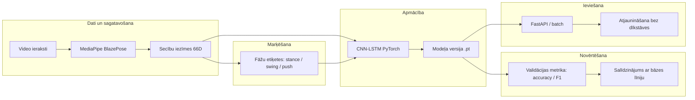
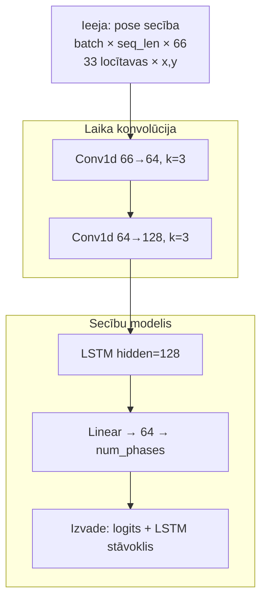
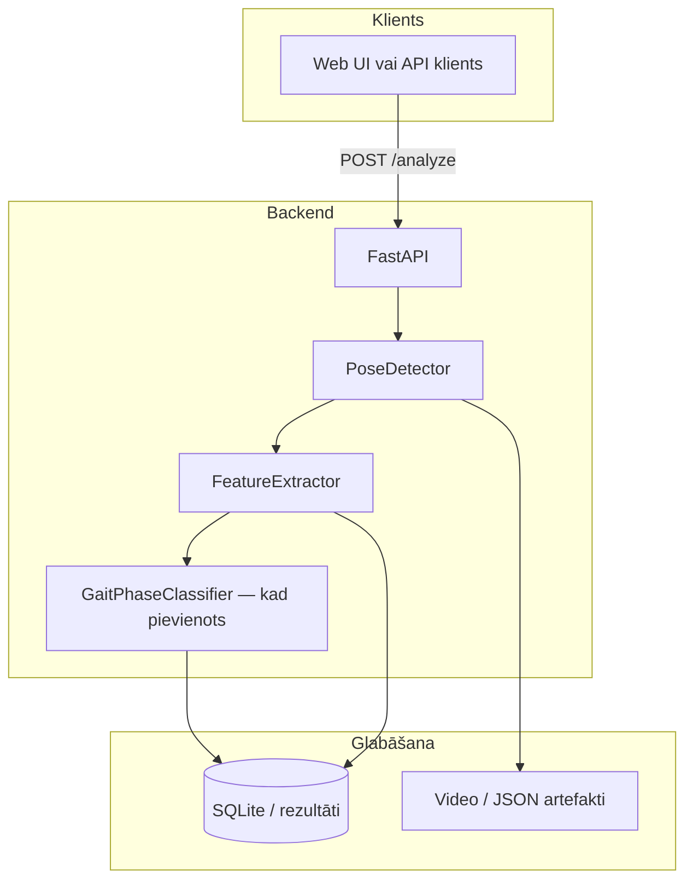

# ML izstrāde — vizualizācijas prezentācijai

Šajā failā ir **Mermaid** diagrammas, ko vari ielikt PowerPoint / Google Slides / Keynote.

## Kā iegūt attēlu

1. Atver [https://mermaid.live](https://mermaid.live)
2. Iekopē zemāk esošo ` ```mermaid ... ``` ` bloku (bez ārējām atzīmēm — tikai saturu starp mermaid tagiem)
3. **Export** → PNG vai SVG
4. Ievieto slaidā

Ieteikums: eksportē **SVG** ja vajag maksimālu asumu projektorā.

---

## 1. attēls — ML izstrādes cikls (projekta kontekstā)

Šis parāda tipisko **MLOps / izstrādes** plūsmu: dati → iezīmes → modelis → novērtēšana → ieviešana.



---

## 2. attēls — `GaitPhaseClassifier` datu plūsma (arhitektūra)

Atbilst `models/gait_classifier.py`: ieeja `(batch, seq, 66)` → Conv1d → LSTM → logits.



---

## 3. attēls — pilna sistēma: CV + ML + API (augsta līmeņa)

Noderīgs kā **1. slaida** pārskats.



---

## Īss teksts slaidam (bulleti)

- **Ieeja**: normalizētas pozu koordinātas secībā (66 kanāli uz laika soli).
- **Modelis**: CNN pār laika asi + LSTM kontekstam starp kadriem.
- **Uzdevums**: gaitas fāžu klasifikācija (vai anomāliju detekcija ar autoencoder).
- **Izstrāde**: PyTorch → saglabāts `.pt` → integrācija API vai atsevišķa inferenci.

---

## Licences un avoti slaidam

- MediaPipe BlazePose — Google MediaPipe dokumentācija.
- PyTorch — pytorch.org.
